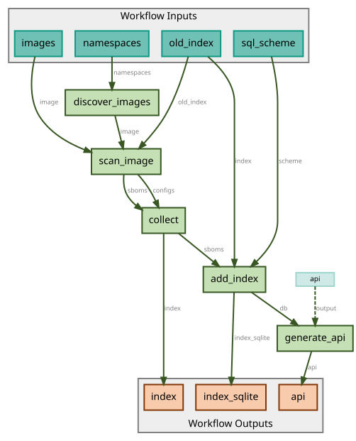
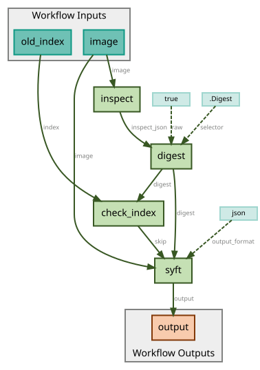

# Container Registry Index

An automatically updated SBOM index for container images pulled from a configurable set of
Docker Hub namespaces. A daily [CWL](https://www.commonwl.org/) workflow discovers images,
scans each one with [Syft](https://github.com/anchore/syft), stores the resulting package
inventory in a SQLite database, and publishes it as a static JSON API plus a browsable website.

## Workflow

The pipeline is defined as CWL workflows in [`workflows/`](workflows/) and driven by
[`job.yml`](job.yml) (which namespaces/images to include) and [`index.sql`](index.sql)
(the database schema).

### Main workflow



[`workflows/workflow.cwl`](workflows/workflow.cwl) ties the whole pipeline together:

1. **`discover_images`** ([`scripts/discover_images.py`](scripts/discover_images.py)) — queries
   the Docker Hub API for each configured namespace and picks the most recently updated tag for
   every repository, in addition to any images listed explicitly in `job.yml`.
2. **`scan_image`** — runs the scan-image sub-workflow (below) for every discovered image,
   scattered in parallel.
3. **`collect`** — gathers all newly produced SBOMs into an `index/sbom/sha256/` directory and
   gzips them.
4. **`add_index`** ([`scripts/add_index.py`](scripts/add_index.py)) — loads the new SBOMs into
   the SQLite index (`index.sqlite`), applying the schema from `index.sql` and skipping images
   that are already indexed.
5. **`generate_api`** ([`scripts/generate_api.py`](scripts/generate_api.py)) — exports the
   contents of the SQLite index as a tree of static JSON files under `api/`.

### Scan-image sub-workflow



[`workflows/scan-image/workflow.cwl`](workflows/scan-image/workflow.cwl) processes a single
image:

1. **`inspect`** — runs `skopeo inspect` to resolve the image's digest and metadata.
2. **`digest`** — extracts the digest from the inspect output via `jq`.
3. **`check_index`** ([`scripts/check_index.py`](scripts/check_index.py)) — checks whether the
   digest already exists in the previous index; if so, the image is skipped to avoid re-scanning
   unchanged images.
4. **`syft`** — if not already indexed, generates a full SBOM for the image in JSON format.
## API

The generated index is exposed as a set of static, pre-rendered JSON files under
[`api/`](api/), so it can be served directly from GitHub Pages without a backend.

| Path | Description |
|---|---|
| `api/images.json` | List of all indexed images (digest, registry, repository, tag, architecture, os, size). |
| `api/images/<digest>.json` | Full detail for a single image, including its complete list of packages (`ecosystem`, `name`, `version`). |
| `api/packages.json` | List of all package ecosystems present in the index (e.g. `npm`, `python`, `deb`, `apk`, `go-module`, `java-archive`, `gem`, `rust-crate`, `dotnet`, `R-package`, `binary`). |
| `api/packages/<ecosystem>.json` | For one ecosystem, a map of package name → version → list of image digests containing that version. |

The underlying data model is a SQLite database (`index/index.sqlite`, schema in
[`index.sql`](index.sql)) with two tables:

- `images` — one row per scanned image (`digest`, `registry`, `repository`, `tag`,
  `architecture`, `os`, `size`, `sbom_path`, `scanned_at`).
- `packages` — one row per package found in an image's SBOM (`image_digest`, `ecosystem`,
  `name`, `version`), indexed for fast lookups by ecosystem/name/version.

Raw, gzip-compressed Syft SBOMs (full CycloneDX/Syft JSON output) are kept under
`index/sbom/sha256/<digest>.json.gz` for anyone who needs more detail than the flattened API
provides.

## Webpage

[`web/`](web/) is a static site built with [Astro](https://astro.build/) that browses the
generated API. It reads directly from the repo-root `api/` directory at build time (see
[`web/src/lib/api.ts`](web/src/lib/api.ts)) and pre-renders one page per image and per package
ecosystem — no client-side fetching or backend required.

Pages:

- **Images** (`/`) — a sortable, filterable table of all indexed images.
- **Image detail** (`/images/<digest>/`) — registry, tag, architecture/OS, size, and the full
  package list for one image.
- **Packages** (`/packages/`) — a grid of package ecosystems.
- **Ecosystem detail** (`/packages/<ecosystem>/`) — packages and versions for one ecosystem,
  linking back to the images that contain them.

### Local development

```sh
cd web
npm ci
npm run dev
```

The dev server reads from `../api`, so run `cwltool` (or otherwise populate `api/`) at least
once before starting it.

### Deployment

The site is built with `npm run build` and deployed to GitHub Pages by
[`deploy-pages.yml`](.github/workflows/deploy-pages.yml), alongside a copy of `api/` so the
deployed site and its data live under the same origin.
